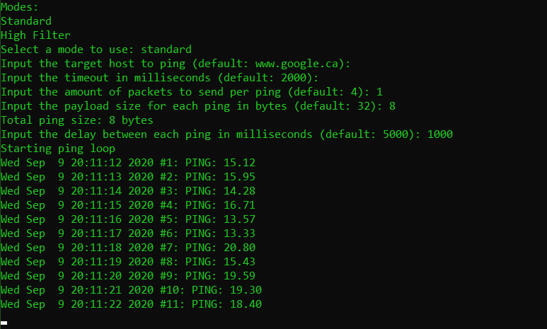

# pyping
A simple ping test using the pythonping package.

## Running from executable
1. [Download the executable here](https://github.com/thegamecracks/pyping/releases/latest) (As of now, there is only a windows build)
2. Run the file

## Running from source code
1. Download this repository
2. Install packages as specified in requirements.txt
3. Run `main.py`
